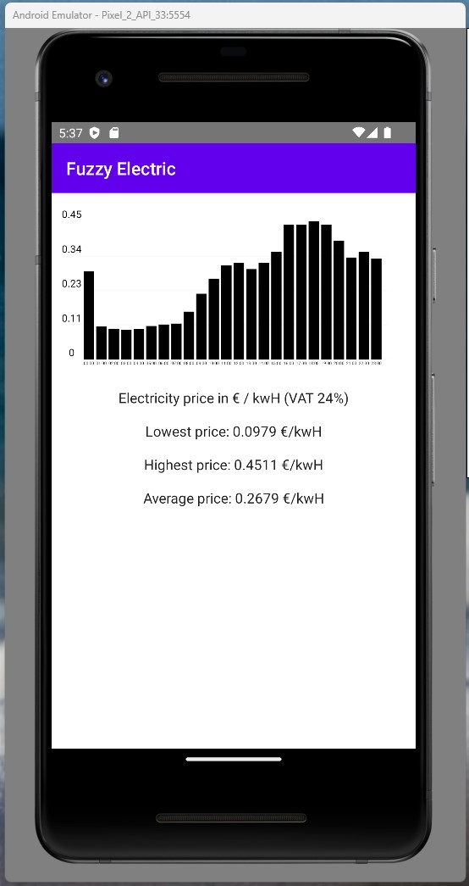
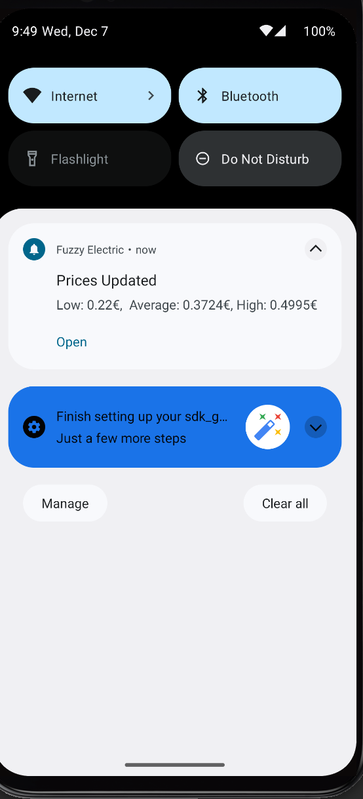

# Electricity display app

* Small application to display daily electricity spot prices, spot prices updates around 13-14:00 gmt+2 from external api

## Planning

* api is located in [https://transparency.entsoe.eu/content/static_content/Static%20content/web%20api/Guide.html](https://transparency.entsoe.eu/content/static_content/Static%20content/web%20api/Guide.html)
* Going use jetpack compose to build the app and use notifications also
* Notifications will have following information : the hour which has the highest price and lowest price and average price for the whole day.

### Back-end (under construction)
* currently using spot-hinta.fi
* python script to download electric data      https://github.com/EnergieID/entsoe-py
* node, express, postgresql and sequelize orm, simple api-key authencation to access the api

## Mockup / Pre-design

* Bar chart to display data, 24h as default
* lowest/highest/avg price to display

## Working

* Charts are displayed with https://github.com/hi-manshu/Charty library, designed to use with jetpack compose

## Under construction features
* Display week/mont/year data
* Country select
 
## Screenshot

